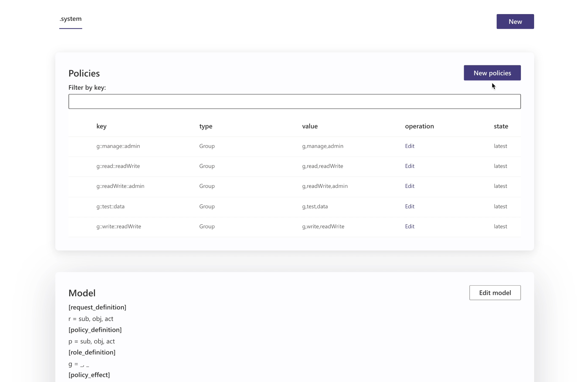
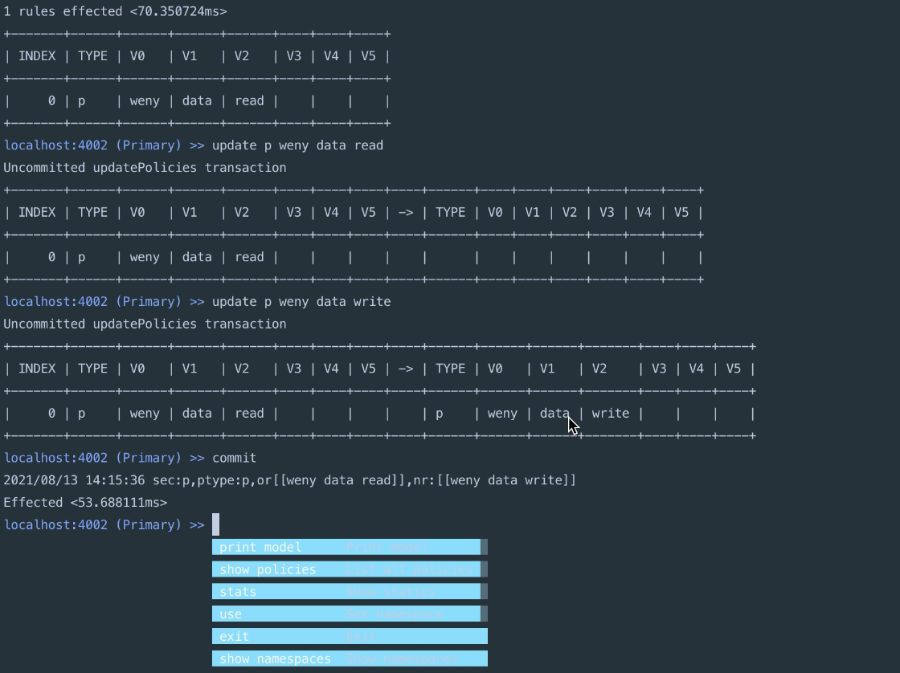
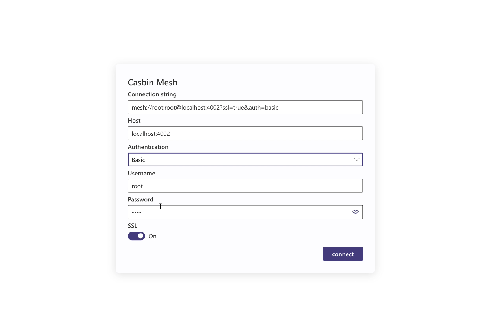
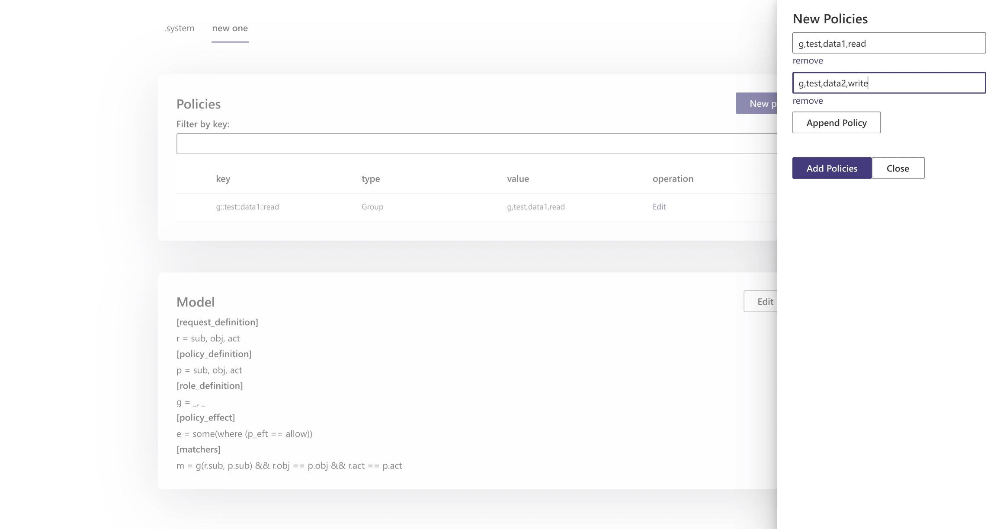

# Casbin-Mesh

（图1 为 Casbin Mesh GUI 组件，用户可以通过 GUI 组件对数据和集群进行管理）

Casbin Mesh 是一个轻量级的 Casbin 分布式解决方案，使用 Raft 共识算法同步多节点中的 Casbin 数据。

## 为什么要使用 Casbin Mesh？

当单机无法支撑我们业务请求时，一般来说我们会对我们的服务器进行水平扩容。换句话说，也就是额外增加多台服务器来响应业务请求。

对于使用 Casbin 的项目来说，进行水平扩容并不容易。因为 Casbin 本身就是一个有状态的（Stateful）的应用，如何同步多节点中的状态（或者说 Polices）便成了最大的问题。Casbin Mesh 将为用户提供一个开箱即用 Casbin 水平扩展的解决方案，在未来我们会提供 Helm Charts， Kubernetes operator 进一步简化用户部署及维护。

### 社区现有方案 Watcher

社区目前常用的方案有基于 Pub/Sub 的 Watcher，Watcher 最大的问题在于当网络出现错误时，两个节点中的数据会出现“暂时的不一致”，这里的暂时可能是几百 ms，或者数十秒，甚至出现网络分区，也就是两个节点之间的网络中断。尽管 Pub/Sub 会保证同步信息最终送达，但是在两个节点出现“暂时的不一致”时，我们的客户端对此是无感知的，也就是说，当遇到“暂时不一致”时，有可能我们读到了一个旧的数据，最终导致我们的业务出错。

### 我们解决方案

Casbin Mesh 使用 Raft 共识算法同步多节点中的 Casbin 数据，并且提供了多种级别的读请求选项。

（图2 为 Raft 共识的工作原理，当 log 复制到多数 Followers 后，Leader 将返回 Client 请求）

- 当业务方没有绝对的强一致读的需求时，我们可以从 Follower 节点读取数据，并可以保证当前 Follower 最后与 Leader 同步数据时间戳晚于当前时间戳减去用户设定的阈值，换句话说，用户可以通过设定读请求中的阈值（通常阈值在 50-100ms），来保证当前
- 当业务方有强一致读需求时，我们依然需要将 Follwer 节点的接收到的读请求转发到 Leader 节点进行执行，这样执行的结果是可以保证强一致的。
  - Raft Read Index 支持（In Processing）：Follower 节点在接收到读请求时，Follower 会询问 Leader 当前 Commit Index 信息， Follower 等待自己 Applied Index 大于获取的 Commit Index 后，返回客户端的读请求。 Raft Read Index 用 Leader 向 Follower 发送心跳包代替了大量的读请求 Logs 复制到 Follower 节点中，从而减少了不必要的 Log 复制的网络开销，同时也降低了 Leader 节点的读请求压力。

通常来说，从 Follower 节点读，并阈值小于等于 50 ms 已经足够满足我们绝大数业务需求。

## 当前的进度

Casbin Mesh 的主仓库在 https://github.com/casbin/casbin-mesh ，Casbin Mesh 的 API 基本可用，我们目前还在为发布**稳定版**做更多的测试以及完善相关其他组件。同时，社区中也有一些用户的数据量是远超过内存大小的场景，对此，我们也正在写一个未来会集成到 Casbin Mesh 中的，一个[新的 Casbin 执行引擎](https://github.com/casbin-mesh/neo)，来解决这个问题。同时我们也欢迎对分布式系统，以及数据库内核感兴趣的同学参与到这个项目来，我们会去阅读一些前沿的论文，并尝试在项目中落地。例如，在新的引擎中，我们可能会引入 Immutable Adaptive Radix Tree 用作 Index 。

（图3 为 Casbin Mesh Command Line Interface，用户可以通过该组件对数据和集群进行管理）

Casbin Mesh 有独立的 Command Line Interface, GUI 组件, 用户可通过这些组件对数据和集群进行管理。在未来我们还会提供 Helm Charts 和 Kubernetes operator 进一步简化用户部署及维护，以及相关数据迁移工具。

**GUI**

（图4 为通过 GUI 登陆页面，未来我们将支持 Mutual-TLS 登陆 ）

（图5 为通过 GUI 添加 Policies）
